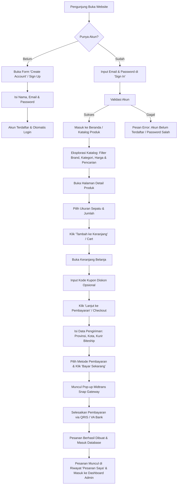
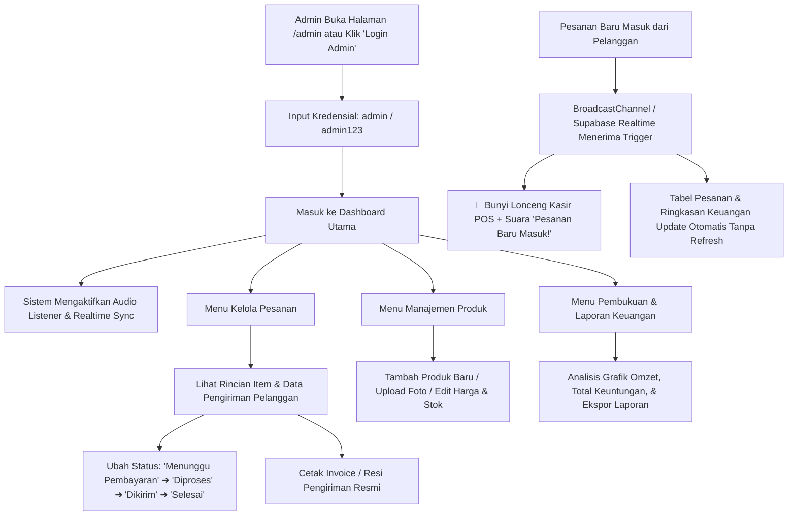

# 📋 Laporan Alur Sistem (Flow) & Buku Panduan Tutorial Sports Station

Dokumen ini berisi dokumentasi alur kerja (*system workflow*), diagram proses transaksi, serta panduan operasional lengkap untuk **Pengguna (Customer)** dan **Administrator Toko (Admin)** pada platform e-commerce **Sports Station**.

---

## 🏛️ 1. Gambaran Umum Arsitektur & Teknologi

Aplikasi **Sports Station** dibangun dengan arsitektur web modern yang cepat, responsif di seluruh perangkat (*desktop, tablet, & mobile*), dan terintegrasi dengan ekosistem e-commerce Indonesia:

- **Frontend**: HTML5 Semantik, Vanilla CSS3 (Custom Design System tanpa dependensi berat), Vanilla JavaScript ES6+.
- **Database & Cloud Sync**: Supabase Cloud PostgreSQL + Supabase Realtime WebSocket Channels.
- **Payment Gateway**: Midtrans Snap API (Serverless Vercel Node.js API `/api/snap-token.js` mendukung QRIS, GoPay, ShopeePay, dan Virtual Account Bank BCA, Mandiri, BNI, BRI, Permata).
- **Logistik & Ekspedisi**: Biteship Multi-Courier Integration (JNE, J&T, SiCepat, Anteraja, Pos Indonesia, GoSend, GrabExpress).
- **Notifikasi & Audio Engine**: Web Audio API Synthesizer (Cashier Bell Chime) + SpeechSynthesis Voice Alert + `BroadcastChannel` (0ms sinkronisasi antar-tab).

---

## 🔄 2. Diagram Alur Sistem (System Flowchart)

### A. Alur Pengguna (Customer Transaction Flow)

---

### B. Alur Administrator (Admin Dashboard & Order Processing Flow)

---

## 👤 3. Panduan Penggunaan untuk Pengguna (Customer Guide)

### Langkah 1: Pendaftaran Akun (Sign Up) & Masuk (Sign In)
1. Buka website **Sports Station** (`https://sportstation-seven.vercel.app/`).
2. Klik tombol **Login** pada pojok kanan atas header (atau buka menu samping di HP).
3. **Jika belum punya akun**:
   - Klik tulisan ***"I don't have an account"*** di sebelah kanan judul *Sign In*.
   - Masukkan **Nama Lengkap**, **Alamat Email**, dan **Kata Sandi** (minimal 4 karakter).
   - Klik tombol oranye **"Create Account"**.
4. **Jika sudah punya akun**:
   - Masukkan Email dan Kata Sandi, lalu klik **"Sign In"**.
   - *(Jika akun belum pernah didaftarkan, sistem akan menolak dan memberikan tombol pintas "Daftar Akun Sekarang")*.

---

### Langkah 2: Mencari & Memilih Produk
1. Gunakan menu navigasi utama untuk memilih kategori:
   - **BRANDS**: Nike, Adidas, Puma, New Balance, Skechers, Converse, Reebok, Asics, Vans, dll.
   - **GENDER**: Men, Women, Kids.
   - **SPORTS & SALE**: Perlengkapan lari, basket, training, serta diskon spesial.
2. Gunakan **Bilah Pencarian (Search)** di header untuk mencari sepatu berdasarkan nama model atau tipe olahraga.
3. Di halaman katalog (`shop.html`), gunakan filter di sisi kiri:
   - Filter Kategori (Sepatu Lari, Sepatu Basket, Sneakers Kasual, Apparel, Aksesoris).
   - Filter Merek / Brand.
   - Filter Rentang Harga & Pengurutan (*Termurah, Termahal, Terpopuler*).

---

### Langkah 3: Halaman Detail Produk & Panduan Ukuran (Size Guide)
1. Klik salah satu produk yang diminati.
2. Di halaman detail produk:
   - Lihat galeri foto produk dengan resolusi tinggi.
   - Pilih **Ukuran (Size)** yang sesuai (misal: EU 40, EU 41, EU 42, EU 43).
   - Klik tombol **"Panduan Ukuran (Size Guide)"** untuk melihat tabel konversi ukuran kaki resmi Sports Station.
   - Tentukan jumlah barang (*Quantity*).
3. Klik tombol **"Tambah ke Keranjang"** (*Add to Cart*).
4. Notifikasi hijau akan muncul dan angka di ikon troli keranjang akan bertambah.

---

### Langkah 4: Keranjang Belanja (Shopping Cart) & Kupon Promo
1. Klik ikon **Keranjang (Troli)** di header atas.
2. Di halaman keranjang:
   - Periksa daftar barang, ukuran, dan jumlah pesanan.
   - Anda dapat menambah/mengurangi jumlah atau menghapus item.
   - Masukkan **Kode Promo** (Contoh: `SPORTS10` untuk diskon 10% atau `HEMAT50K` untuk potongan Rp 50.000).
3. Pastikan rincian ringkasan belanja sudah benar, lalu klik **"Lanjut ke Pembayaran"** (*Proceed to Checkout*).

---

### Langkah 5: Pengisian Data Pengiriman (Checkout)
1. Di halaman Checkout:
   - Lengkapi **Data Penerima**: Nama Lengkap, Nomor WhatsApp, dan Email.
   - Pilih **Wilayah Pengiriman**: Provinsi, Kota/Kabupaten, Kecamatan, dan Kode Pos.
   - Masukkan **Alamat Lengkap** (Nama jalan, nomor rumah/gedung, patokan).
   - Pilih **Opsi Kurir / Layanan Pengiriman** (Reguler, Express, Same Day, Kargo). Biaya ongkos kirim akan dikalkulasikan secara otomatis ke total tagihan.
2. Pilih metode transaksi **"Pembayaran Otomatis Midtrans (QRIS, VA Bank, E-Wallet)"**.
3. Klik tombol oranye besar **"Bayar Sekarang (Buka Midtrans)"**.

---

### Langkah 6: Pembayaran via Midtrans Snap Gateway
1. Pop-up jendela resmi **Midtrans Snap** akan terbuka di layar.
2. Pilih metode pembayaran yang diinginkan:
   - **QRIS / GoPay / ShopeePay**: Pindai kode QR langsung dari aplikasi m-banking atau e-wallet Anda.
   - **Bank Transfer (Virtual Account)**: Pilih BCA, Mandiri, BNI, BRI, atau Permata untuk mendapatkan nomor Virtual Account unik.
3. Lakukan pembayaran sesuai nominal sebelum batas waktu berakhir.
4. Setelah pembayaran berhasil, halaman konfirmasi sukses akan terbuka dan nomor Invoice pesanan (contoh: `SS-ORD-928172`) akan diterbitkan.

---

### Langkah 7: Memeriksa Riwayat Pesanan (Order History)
1. Klik menu **Profile** pada header > pilih **"Pesanan Saya"** (`orders.html`).
2. Anda dapat melihat status seluruh pesanan:
   - 🟡 **Menunggu Pembayaran** (*Pending*)
   - 🔵 **Diproses** (*Processing*)
   - 🟣 **Sedang Dikirim** (*Shipped / In Transit*)
   - 🟢 **Selesai** (*Delivered*)
3. Klik **"Lihat Rincian & Resi"** untuk melihat detail barang, alamat pengantaran, dan pelacakan kurir.

---

## 🛠️ 4. Panduan Penggunaan untuk Administrator (Admin Guide)

### Langkah 1: Masuk ke Dashboard Administrator
1. Buka URL: `https://sportstation-seven.vercel.app/admin` atau dari halaman `login.html`.
2. Di halaman login, klik tombol hitam **"Login Admin"** (atau ketik Username: `admin` dan Password: `admin123`).
3. Anda akan langsung diarahkan ke **Admin Dashboard & Operations Center**.

---

### Langkah 2: Memantau Ringkasan & KPI Penjualan (Overview)
Di tab **Overview Penjualan**:
- **Total Omzet (Revenue)**: Akumulasi seluruh nominal transaksi yang berhasil.
- **Total Unit Terjual**: Jumlah kuantitas produk yang sudah terjual ke pelanggan.
- **Pesanan Perlu Diproses**: Jumlah pesanan baru yang membutuhkan tindakan pengiriman dari gudang.
- **Nilai Rata-rata Pesanan (AOV)**: Rata-rata pengeluaran per transaksi.
- **Grafik Tren Penjualan**: Menampilkan performa penjualan harian/mingguan.
- **Top 5 Produk Terlaris**: Daftar sepatu dengan penjualan tertinggi.

---

### Langkah 3: Pengaturan Notifikasi Suara Pesanan Masuk (Audio Bell)
1. Perhatikan bilah atas (*topbar*) sebelah kanan:
   - Tombol **`Suara: Aktif`** (berwarna oranye): Menandakan suara lonceng kasir menyala.
   - Tombol **`Tes`** (ikon speaker): Klik tombol ini kapan saja untuk menguji suara lonceng kasir dan suara *voice alert*.
2. **Cara Kerja Realtime**:
   - Begitu ada pembeli yang menyelesaikan checkout di perangkat/tab manapun, sistem admin akan langsung **membunyikan lonceng kasir POS 4-nada** dan mengumumkan *"Pesanan baru masuk!"* tanpa admin perlu me-refresh halaman browser.

---

### Langkah 4: Pemrosesan & Perubahan Status Pesanan
1. Klik menu **"Kelola Pesanan"** di bilah navigasi samping (*sidebar*).
2. Di tabel pesanan:
   - Gunakan kolom pencarian untuk mencari ID Pesanan atau Nama Pelanggan.
   - Gunakan filter tab status: *Semua, Menunggu Pembayaran, Diproses, Dikirim, Selesai, Dibatalkan*.
3. Pada kolom **Aksi**, Anda dapat:
   - Mengubah status pesanan secara langsung melalui menu dropdown.
   - Mengklik tombol **"Detail"** untuk melihat daftar item, ukuran, kurir, dan alamat lengkap pembeli.
   - Mengklik tombol **"Cetak Invoice"** untuk mencetak struk/faktur resmi berlogo Sports Station untuk ditempelkan di paket pengiriman.

---

### Langkah 5: Manajemen Katalog & Stok Produk
1. Klik menu **"Katalog & Stok"** di sidebar.
2. **Menambah Produk Baru**:
   - Klik tombol **"+ Tambah Produk Baru"**.
   - Isi Nama Produk, Merek (Brand), Kategori (Lari/Basket/Casual), Harga Asli, Harga Diskon (opsional), Pilihan Ukuran, dan Jumlah Stok.
   - Masukkan URL foto produk atau upload foto dari komputer.
   - Klik **"Simpan Produk"**.
3. **Mengedit / Menghapus Produk**:
   - Cari produk di tabel inventaris.
   - Klik ikon **Pensil (Edit)** untuk mengubah harga atau memperbarui stok barang.
   - Klik ikon **Sampah (Hapus)** untuk menghapus produk dari etalase toko.

---

### Langkah 6: Pembukuan & Laporan Keuangan (Financial Ledger)
1. Klik menu **"Pembukuan & Kas"** di sidebar.
2. Anda dapat melihat:
   - Catatan Kas Masuk (*Income Entry*) dari setiap transaksi penjualan.
   - Laba Bersih & Margin Keuntungan per transaksi.
   - Opsi pencatatan Pengeluaran Operasional Toko (seperti biaya packing, sewa rak, gaji staf gudang).
   - Tombol **"Ekspor Laporan (CSV / Excel)"** untuk mencetak laporan rekapitulasi keuangan bulanan.

---

### Langkah 7: Manajemen Database Cloud (Supabase Sync)
1. Klik tombol **"Database Cloud"** di topbar atas.
2. Anda dapat mengonfigurasi koneksi Supabase:
   - **Supabase Project URL**: `https://<project-id>.supabase.co`
   - **Supabase Anon Public Key**: Kunci API publik proyek.
3. Klik **"Simpan & Hubungkan"** untuk menyinkronkan seluruh katalog produk dan pesanan secara terpusat di cloud database.

---

## 🔑 5. Kredensial Akun Pengujian (Demo & Test Accounts)

| Tipe Akun | Username / Email | Kata Sandi | Akses Halaman | Keterangan |
|---|---|---|---|---|
| **Administrator** | `admin` *(atau `admin@sportsstation.id`)* | `admin123` | `/admin` | Akses penuh dashboard penjualan, katalog, keuangan, dan status order |
| **Demo Customer** | `aznidaniswata@gmail.com` | `SportsStation123` | `/shop`, `/cart`, `/checkout`, `/orders` | Akun pelanggan demo dengan riwayat pesanan dan poin member |
| **Pengguna Baru** | Bebas didaftarkan via form Sign Up | Ditentukan pengguna (min. 4 kar) | Seluruh fitur customer | Registrasi akun instan dengan validasi email |

---

## 🚀 6. Ringkasan Fitur Unggulan Sistem

> [!TIP]
> **Fitur Andalan E-Commerce Sports Station:**
> 1. **Zero Refresh Order Sync**: Pesanan baru langsung muncul di tabel admin dalam 1.5 detik dengan efek suara lonceng kasir.
> 2. **Midtrans Payment Gateway Otomatis**: Integrasi pembayaran multi-channel instan tanpa konfirmasi manual.
> 3. **Biteship Courier Rate Engine**: Kalkulasi ongkos kirim akurat berdasarkan kota tujuan dan jenis ekspedisi.
> 4. **Mobile First Responsive Design**: Tampilan drawer navigasi, katalog, dan checkout yang optimal di smartphone.
> 5. **Keamanan & Validasi Ketat**: Blokir otomatis bagi pengguna yang belum mendaftar akun dan pencegahan kebocoran session.
